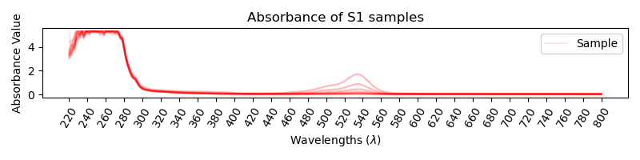
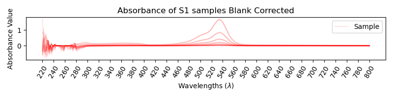
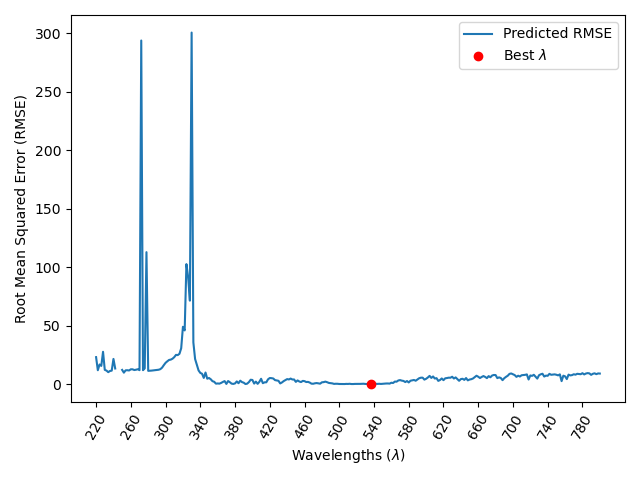

# colorfix_task
## Introduction 
Hello! Welcome to my repository! 
This is a repository for the technical assesment 
for the position at Colorfix ltd.

With a given calibration measurement and a sample measurement I'll have to predict the sample concentrations of a chemical
compound. 

For this I'll have to read, clean the calibration data, blank-correct it, and find the best wavelength at which 
we should measure this compound. 

### STEP1 - Blank Correct the data 

As stated in the main.py , we first load the data with the sample class and select both experimental values and blank. 

We have to correct the values by subtracting the blank from the samples.

Original:

Blank-Corrected:

 

### STEP2 - Calculate values for E coefficient

We have to calculate now the absorptivity coefficient at each wavelength since it is a function of wavelength.
Following the Beer-Lamber equation, we can find E by dividing absorbance by concentration*optical_path_length (A/c*l). 

Plot of the found Error at different wavelengths: 

### STEP3 - Recalculate concentrations at different wavelenghts  
Now we want to recalculate using Beer-Lamber equation again, what the predicted accuracy would be with a given E 
coefficient. This time we find the concentration C by dividing absorbance by E_coeff*optical_path_length (A/E*l) 
We then check the Root Mean Squared Error (RMSE) for each wavelength. This way, we can find the wavelength that is best 
for predicting our compound. 

### STEP4 - Predict concentration at the best wavelength 

Now we can load in the data from the sample unkown concentrations given using the same as in STEP3. 

The thinking hands on approach on this can be found at the raw_notebook.ipynb

# Usage
This is meant to be used as a semi-automated script:
1. **main.py** : Main script that puts together the whole approach described above and plots relevant info. 
2. **input_reader.py** : Takes care of the **STEP1** with functions for reading in the data and plotting it.  
3. **prediction_model.py** : Takes care of the **STEP2, STEP3** and **STEP4** with functions for prediction, calculating E and 
a wrapper for calculating accuracies at wavelengths and finding the best one to predict concentration. 

# Installation requirements

To run this code you will need the required packages that can be found at requirements.txt, those are the ones 
I had installed while working, which are:
1. **matplotlib** I used version 3.5.3
2. **numpy** I used version 1.21.5
3. **panda**s I used version 1.2.3

Regarding python, I have run it Python 3.7.12 and tested it on Python >= 3.8. 